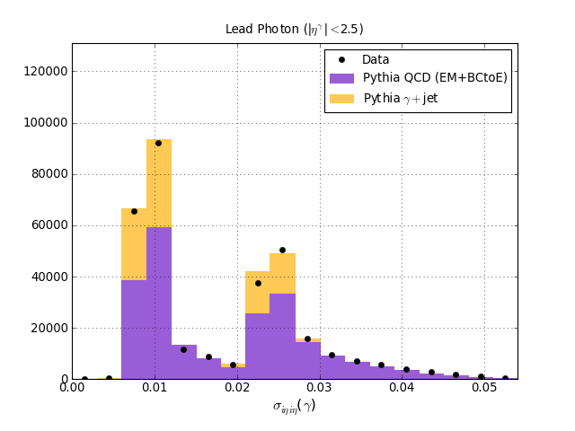

.. rootplot documentation master file, created by
   sphinx-quickstart on Mon Mar  1 13:54:08 2010.
   You can adapt this file completely to your liking, but it should at least
   contain the root `toctree` directive.

.. module:: rootplotpackage
   :synopsis: Tools for quick, beautiful plotting with ROOT
.. moduleauthor:: Jeff Klukas <klukas@wisc.edu>

Tools for Quick and Attractive Plotting with ROOT
========================================================

ROOT is a powerful data analysis tool within the particle physics community, and the primary lens through which we see our data.  The framework includes quite a bit of graphical capability, but this has understandably not been the first priority in designing its capabilities or its interface.

The |rootplotpackage| package exploits the |pyROOT| interface to provide scripts and libraries to make working with the graphical side of ROOT easier.

For immediate figures with a minimum of effort from any ROOT file filled with histograms, take a look at the |rootplot| command-line tool.

To get a quick glimpse at the contents of a ROOT file from the command-line, try :mod:`rootinfo`.

To quickly produce histograms from a ROOT tree or ntuple, take a look at the |tree2hists| command-line tool.

To plot ROOT figures with the powerful |matplotlib| python plotting package, take a look at the |root2matplotlib| library and :mod:`rootplotmpl`.

Future
------------------------------------------
Many of the under-the-hood features of the |rootplotpackage| libraries have also been implemented independently and more robustly in |rootpy|.  Most of the |rootplotpackage| development effort is going into |rootpy| now, with plans to migrate over all features and deprecate this package.  If you are interested in contributing to these tools, take a look at |rootpy|. 

Contact
------------------------------------------
|rootplotpackage| is created, developed, and maintained by Jeff Klukas and Michael Anderson.  You are heartily encouraged to make suggestions and submit bug reports on our `bitbucket page <http://bitbucket.org/klukas/rootplot/issues>`_ or to join the discussion with the `rootplot Users Google Group <http://groups.google.com/group/rootplot-users>`_.

Installation
------------------------------------------
The easiest installation of |rootplotpackage| is through |easyinstall|::

    $ easy_install rootplot

The installer will place the whole |rootplotpackage| package in an appropriate place in your python tree.  It will also install the :mod:`rootplot`, :mod:`rootplotmpl`, :mod:`rootinfo`, and :mod:`tree2hists` scripts in an appropriate :mod:`bin` directory so that they are available on the command line.

The current user base is mostly members of the CMS experiment at CERN, who should know that as of :mod:`CMSSW_3_8_7`, |rootplotpackage| is included in our software framework.  When you run :mod:`cmsenv`, all the command-line tools will be available, and in modern versions (at least as of :mod:`CMSSW_4_2_8`) matplotlib is included, so :mod:`rootplotmpl` is also enabled.  If you'd like to use the |rootplotpackage| API within CMSSW, be aware that it is contained within a subpackage, so import statments should look like:: 

  import PhysicsTools.PythonAnalysis.rootplot

This implementation within a subpackage, however, is flawed and some internal imports won't work.  You will be safer if you explicitly include the subpackage in your python path (after which you will be able to import rootplot as normal)::

     ## example for bash
     export PYTHONPATH="$CMSSW_RELEASE_BASE/python/PhysicsTools/PythonAnalysis/:$PYTHONPATH

For other users at CERN, you can access an existing installation on lxplus::

   $ source /afs/cern.ch/user/k/klukas/public/Sharing/rootplot_setup.sh

This will point to a local installation of |rootplotpackage| and should also set up a compatible cocktail of python, matplotlib, and ROOT.  After you run the script, you can check that it works by trying out some of the :ref:`root2matplotlib examples <root2matplotlib-examples>`.

Interfacing with matplotlib
^^^^^^^^^^^^^^^^^^^^^^^^^^^^^
The |root2matplotlib| library requires that you have both |pyROOT| and |matplotlib| available within a single python installation.  This may be easy on Linux platforms (`see the PyROOT site <http://root.cern.ch/root/HowtoPyROOT.html>`_), but it is more difficult on a Mac.  For additional help, see `instructions for a Mac OSX 10.6 installation <http://root.cern.ch/phpBB2/viewtopic.php?t=9885&highlight=>`_.

Installing from the Repository
^^^^^^^^^^^^^^^^^^^^^^^^^^^^^^
|rootplotpackage| is version controlled with Mercurial.  To download the latest development version::

    $ hg clone http://bitbucket.org/klukas/rootplot
    $ cd rootplot
    $ python setup.py develop

And to update::

    $ hg pull http://bitbucket.org/klukas/rootplot
    $ hg update

Indices and tables
==================

.. toctree::
   :maxdepth: 1

   rootplot
   root2matplotlib
   rootinfo
   tree2hists

* :ref:`genindex`
* :ref:`modindex`
* :ref:`search`

